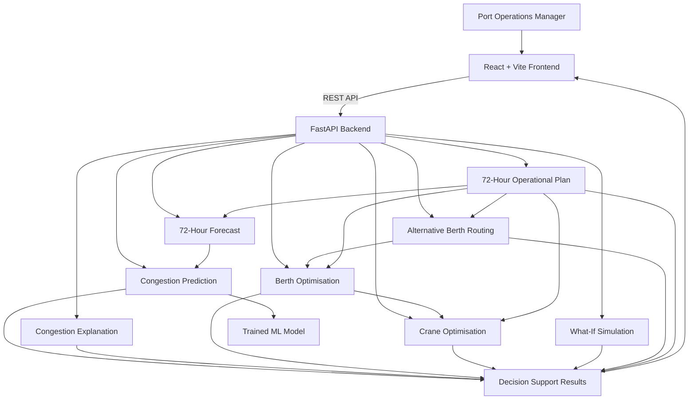

# Architecture

## System Architecture

SmartPort AI follows a modular client-server architecture. The React frontend provides the operator interface, while the FastAPI backend exposes REST APIs that coordinate machine-learning prediction, forecasting, explanation, optimisation, scenario simulation, and operational planning.



The main architectural flow is:

**User → Frontend → REST API → Prediction / Forecasting / Optimisation → Decision Support → Frontend**

The backend is divided into focused services so that prediction, optimisation, forecasting, and planning can be developed and tested independently.

## Components

| Component | Technology | Responsibility |
|---|---|---|
| **Frontend** | React, TypeScript, Vite | Provides the port operations dashboard, congestion analysis, optimisation views, what-if interaction, and 72-hour operational plan. |
| **Backend API** | Python, FastAPI | Provides REST endpoints and coordinates prediction, forecasting, explanation, optimisation, routing, simulation, and planning services. |
| **ML Prediction** | Python, Scikit-learn, Joblib | Uses the trained congestion model to predict congestion levels and probabilities from operational inputs. |
| **Forecasting** | Python | Generates the 72-hour congestion outlook by evaluating predicted congestion under changing operational conditions. |
| **Explanation** | Python | Converts operational conditions into understandable factors that explain why congestion risk is elevated. |
| **Berth Optimisation** | Python | Evaluates berth utilisation, capacity, and resource availability to recommend a suitable berth. |
| **Crane Optimisation** | Python | Evaluates available cranes and operational demand to recommend a crane assignment. |
| **Alternative Berth Routing** | Python | Identifies an alternative berth when it provides a meaningful operational advantage. |
| **What-If Simulation** | Python | Evaluates how changes to vessel arrival conditions can affect predicted congestion. |
| **Operational Planning** | Python | Combines forecast, optimisation, crane, and routing results into a 72-hour time-based action plan. |
| **Model Artifact** | Joblib (`.pkl`) | Stores the trained congestion prediction model used during inference. |

> SmartPort AI does not currently require a persistent database for the hackathon prototype. Operational inputs are processed by the backend and results are returned through the API.

## API Layer

The FastAPI backend exposes dedicated endpoints for the main decision-support capabilities:

| Endpoint | Purpose |
|---|---|
| `GET /` | Confirms that the backend is running. |
| `GET /health` | Provides a health-check response. |
| `GET /api/congestion` | Returns congestion prediction information and the 72-hour forecast. |
| `GET /api/optimization` | Returns berth optimisation and recommendation results. |
| `GET /api/crane` | Returns crane optimisation results. |
| `POST /api/what-if` | Evaluates a changed operational scenario. |
| `GET /api/plan` | Generates the 72-hour operational plan. |

The frontend communicates with these endpoints through a configurable API base URL.

## Data Flow

1. **Operational inputs enter the system:** The backend receives operational values such as vessel count, container volume, average waiting time, berth utilisation, and berth information.

2. **Inputs are passed to the ML model:** The congestion prediction service prepares the inputs in the format expected by the trained machine-learning model.

3. **Congestion is predicted:** The trained model produces a congestion level and prediction probability.

4. **The prediction is explained:** The explanation service evaluates operational conditions and identifies contributing factors such as high berth utilisation, vessel volume, container volume, or waiting time.

5. **The future state is forecast:** The forecasting service evaluates changing operational conditions and generates congestion predictions across a 72-hour horizon.

6. **Berths are evaluated:** The optimisation service compares available berths using factors such as utilisation, capacity, and crane availability.

7. **Crane resources are evaluated:** The crane optimisation service identifies an appropriate available crane based on the operational requirement and berth assignment.

8. **Alternative operational routing is evaluated:** If another berth provides a meaningful advantage, the system can recommend an alternative berth.

9. **What-if scenarios are evaluated:** A changed arrival scenario can be submitted to the backend, which compares the original prediction with the simulated scenario.

10. **The operational plan is generated:** Forecast, berth, crane, and routing results are combined into a 72-hour sequence of recommended actions.

11. **Results are returned to the frontend:** The React application displays the predictions, explanations, recommendations, and operational plan to the port operator.

## Decision Flow

The system is designed around four connected stages:

```text
┌──────────────┐
│   PREDICT    │
│ Where is     │
│ congestion?  │
└──────┬───────┘
       ↓
┌──────────────┐
│   EXPLAIN    │
│ Why is it    │
│ happening?   │
└──────┬───────┘
       ↓
┌──────────────┐
│  OPTIMISE    │
│ What should  │
│ change?      │
└──────┬───────┘
       ↓
┌──────────────┐
│     ACT      │
│ What should  │
│ happen next? │
└──────────────┘
```

This design ensures that the ML prediction is not isolated from the operational decision. Prediction results become inputs to the optimisation and planning stages.

## Security Considerations

The hackathon prototype uses a simple architecture, but the following security practices are considered:

- **No secrets in source code:** API keys, credentials, and other sensitive configuration values should be stored using environment variables rather than committed to Git.

- **CORS configuration:** The backend restricts browser access to configured frontend origins rather than allowing arbitrary production origins.

- **Input validation:** FastAPI and Pydantic validation are used for structured API inputs and numeric constraints where applicable.

- **Minimal data storage:** The prototype does not require a persistent database, reducing the amount of sensitive operational information that needs to be stored.

- **Production authentication:** A real deployment should add authentication and role-based authorisation for port operators, supervisors, and administrators.

- **Secure deployment:** Production communication should use HTTPS, and secrets should be managed through a secure deployment or secrets-management system.

- **Operational data protection:** A production implementation should apply appropriate access controls and encryption for vessel, container, scheduling, and terminal operational data.

## Scalability Notes

The current architecture is designed as a modular prototype that can be extended into a larger production system.

Potential future improvements include:

- **Live data integration:** Connect the system to vessel schedules, terminal operating systems, berth availability, crane telemetry, yard data, weather information, and container movement data.

- **Persistent data layer:** Add a database such as PostgreSQL for storing historical operational data, predictions, optimisation decisions, and performance metrics.

- **Model improvement:** Retrain the congestion model using larger and continuously updated real-world datasets.

- **Advanced optimisation:** Replace prototype optimisation assumptions with constraint-based or mathematical optimisation models that incorporate real port constraints.

- **Horizontal scaling:** The FastAPI backend can be deployed as stateless services behind a load balancer when request volume increases.

- **Background processing:** Long-running forecasting and optimisation tasks can be moved to asynchronous workers or a job queue.

- **Monitoring:** Production deployment should include API monitoring, model-performance monitoring, logging, and alerting.

- **Role-based access:** Different permissions can be introduced for operators, supervisors, and administrators.

## Deployment Architecture

The intended deployment separates the frontend and backend:

```text
                    Internet
                       │
             ┌─────────┴─────────┐
             │                   │
             ▼                   ▼
      ┌─────────────┐     ┌─────────────┐
      │   Vercel    │     │   FastAPI   │
      │   Frontend  │────▶│   Backend   │
      │ React/Vite  │ REST│             │
      └─────────────┘     └──────┬──────┘
                                 │
                    ┌────────────┼────────────┐
                    ▼            ▼            ▼
                 ML Model   Optimisation  Planning
```

During local development, the React frontend communicates with the FastAPI backend running locally. In deployment, the frontend uses the backend's public HTTPS URL through the `VITE_API_URL` environment variable.

## IBM Bob

IBM Bob was used as an AI-powered software development partner during the development of SmartPort AI.

Any product-level integration between SmartPort AI and IBM Bob through the Model Context Protocol (MCP) is only considered part of the application architecture if it is genuinely implemented and verified. The project does not represent a simulated `/bob` endpoint or fabricated Bob response as an integration.

If an MCP-based integration requires external Bob-side configuration, credentials, or deployment configuration, those requirements will be documented separately rather than presented as completed functionality.
